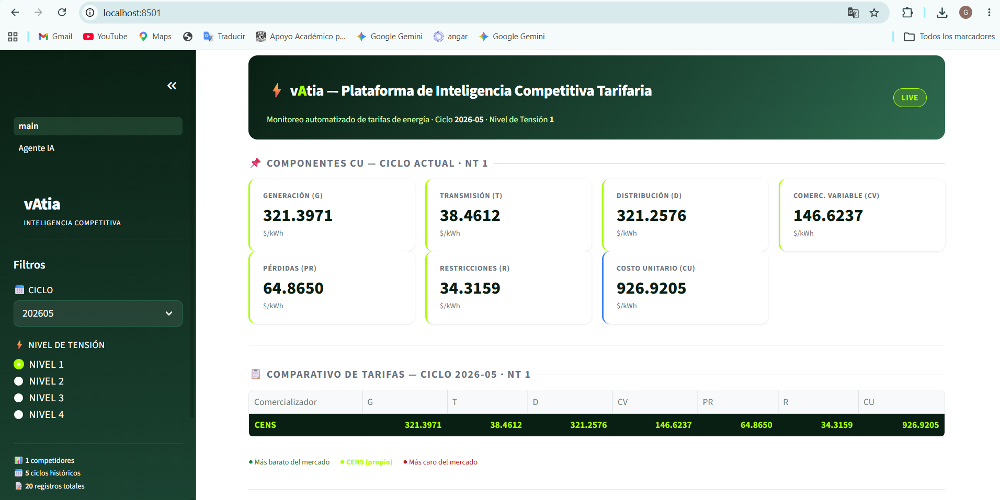
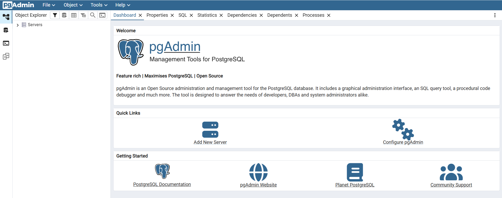

# VATIA — Plataforma de Inteligencia Competitiva Tarifaria

> Prototipo de automatización ETL + dashboard analítico para el monitoreo de tarifas de energía eléctrica de comercializadores en Colombia.

---

## El Reto

VATIA necesita monitorear mensualmente las tarifas de **10 comercializadores** de energía para mantener su competitividad. Hoy ese proceso se hace **manualmente**, consultando PDF por PDF desde los sitios de cada operador.

## Problema

| Síntoma | Impacto estimado |
|---------|-----------------|
| Recolección manual toma ~5 días | Decisiones comerciales tardías |
| Sin histórico estructurado | Imposible ver tendencias |
| Análisis en Excel ad-hoc | Propenso a errores, no reproducible |
| Sin comparativo entre operadores | 3% de ventas en riesgo |

## Solución

Pipeline ETL completamente automatizado que descarga, extrae vía OCR y almacena las tarifas en PostgreSQL, exponiéndolas en un dashboard interactivo con comparativos en tiempo real.

```
PDFs públicos → OCR → PostgreSQL → Dashboard Streamlit
```

---

## Funcionalidades

- **Scraping automático** de PDFs tarifarios desde sitios web de operadores
- **OCR robusto** (EasyOCR + PyMuPDF) para tablas en imágenes rasterizadas
- **Normalización y validación** de componentes tarifarios (G, T, D, Cv, PR, R, CU)
- **Dashboard interactivo** con filtros por ciclo y nivel de tensión
- **Comparativo visual** entre comercializadores con destacado de mín/máx
- **4 gráficos Plotly**: evolución histórica, componentes apilados, heatmap, gauge
- **Explorador de base de datos** via pgAdmin4 en navegador
- **Exportación a CSV** desde el dashboard con un clic
- **Fase 2 (roadmap)**: Agente IA conversacional para análisis de tarifas vía LLM

---

## Prototipo Visual

> **Dashboard Streamlit** — `http://localhost:8501`

<!-- Inserta aquí un pantallazo del dashboard -->


> **pgAdmin4** — `http://localhost:5050`

<!-- Inserta aquí un pantallazo de pgAdmin -->


---

## Tecnologías

| Capa | Tecnología |
|------|-----------|
| Extracción | Python 3.11, Requests, BeautifulSoup4 |
| OCR | EasyOCR 1.7, PyMuPDF 1.23 |
| Transformación | pandas, NumPy |
| Base de datos | PostgreSQL 16, SQLAlchemy 2, psycopg2 |
| Dashboard | Streamlit 1.35, Plotly 5 |
| DB Explorer | pgAdmin4 |
| Contenedores | Docker, Docker Compose |
| Testing | pytest |

---

## Arquitectura

```
┌─────────────────────────────────────────────────────────┐
│                     Docker Compose                       │
│                                                         │
│  ┌──────────┐   scrape+OCR   ┌──────────────────────┐  │
│  │   ETL    │──────────────▶ │   PostgreSQL 16       │  │
│  │(pipeline)│                │   (vatia_db :5432)    │  │
│  └──────────┘                └──────────┬───────────┘  │
│   (on-demand)                           │               │
│                               ┌─────────▼──────────┐   │
│                               │  Streamlit App      │   │
│                               │  (:8501)            │   │
│                               └────────────────────┘   │
│                                                         │
│                               ┌────────────────────┐   │
│                               │  pgAdmin4 (:5050)  │   │
│                               └────────────────────┘   │
└─────────────────────────────────────────────────────────┘
```

## Flujo de Datos

```
1. [Scraper]  GET https://operador.com.co/tarifas
2. [Scraper]  Descarga PDFs del ciclo vigente
3. [OCR]      PyMuPDF renderiza página 4 → EasyOCR extrae tokens
4. [Transform] Agrupa tokens en filas, mapea columnas, valida CU = Σ componentes
5. [Load]     UPSERT en tabla tarifas (ON CONFLICT DO UPDATE)
6. [Export]   CSV → data/processed/tarifas_<operador>.csv
7. [Dashboard] Streamlit lee PostgreSQL vía SQLAlchemy y renderiza comparativos
```

---

## Setup Rápido

### Requisitos
- Docker Desktop instalado y corriendo

### 1. Clonar y configurar
```bash
git clone <repo-url>
cd "Reto VATIA"
cp .env.example .env        # revisar credenciales si es necesario
```

### 2. Levantar servicios
```bash
docker compose up -d
```

Servicios disponibles:

| Servicio | URL | Credenciales |
|----------|-----|--------------|
| Dashboard | http://localhost:8501 | — |
| pgAdmin4 | http://localhost:5050 | admin@vatia.dev / vatia_admin |
| PostgreSQL | localhost:5432 | vatia / vatia_dev_password_change_in_prod |

### 3. Ejecutar el pipeline ETL
```bash
docker compose --profile etl run --rm etl
```

> Primera ejecución tarda ~10 min (descarga modelos OCR). Las siguientes son rápidas.

### 4. Ver el dashboard
Abre http://localhost:8501 — los datos de CENS ya estarán disponibles.

---

## Estado Actual

- ✅ **Fase 1** — ETL CENS (OCR), PostgreSQL, Dashboard Streamlit, pgAdmin4
- 🔄 **Fase 2** — Agente IA conversacional, scrapers de 9 operadores restantes

---

*Equipo VATIA · Mayo 2026*
